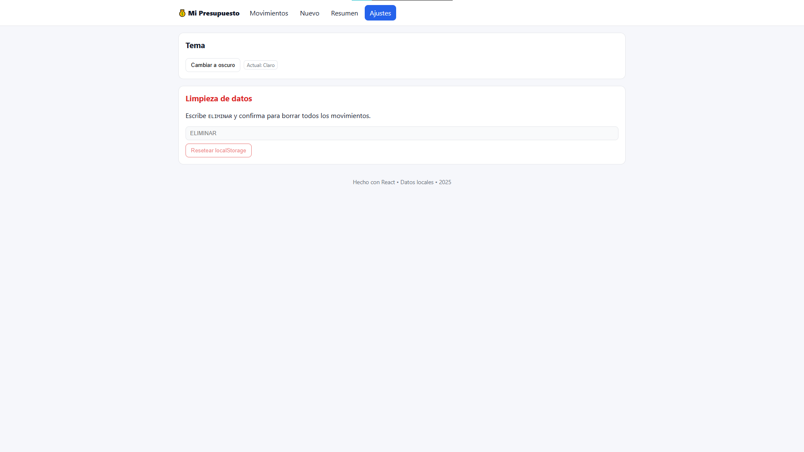
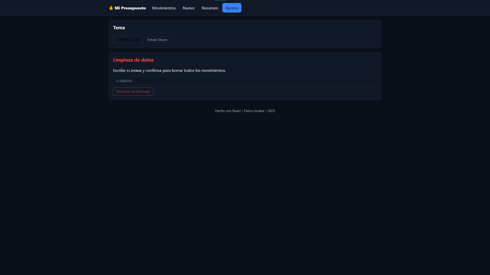
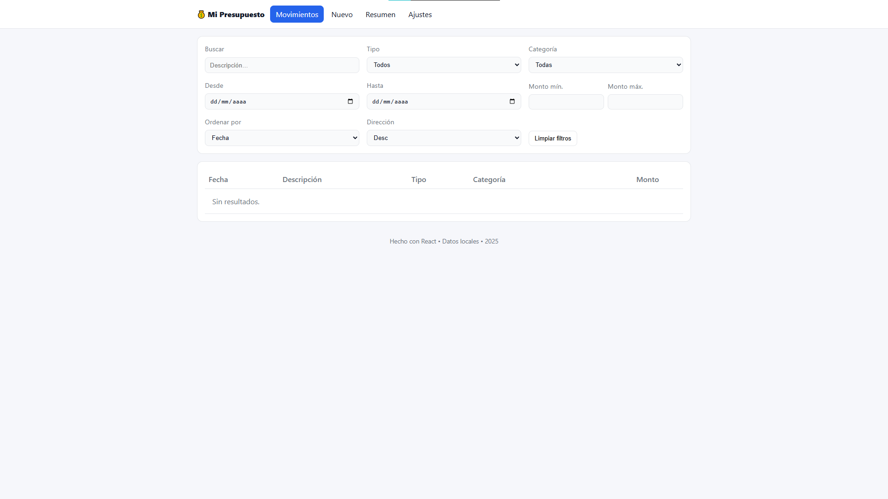
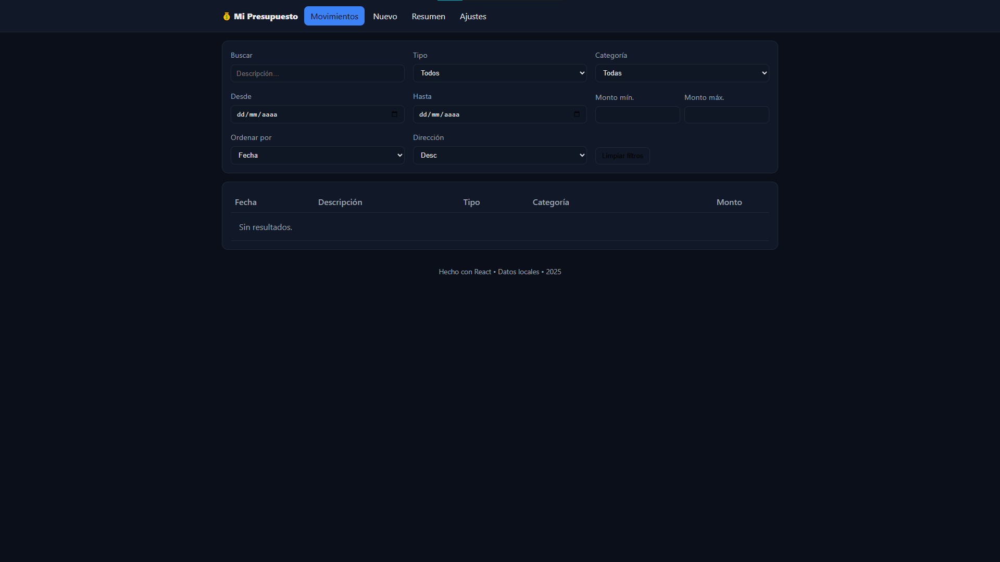
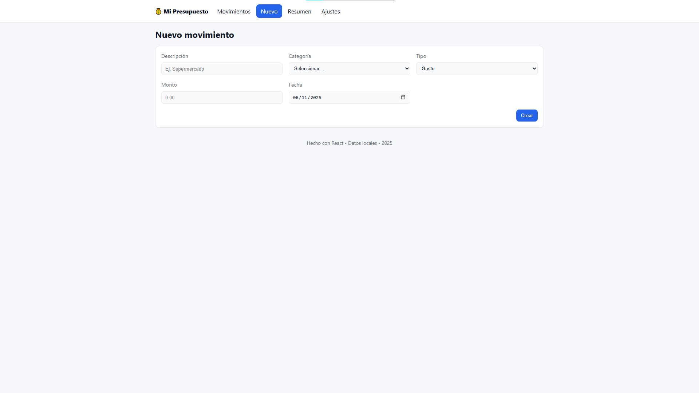
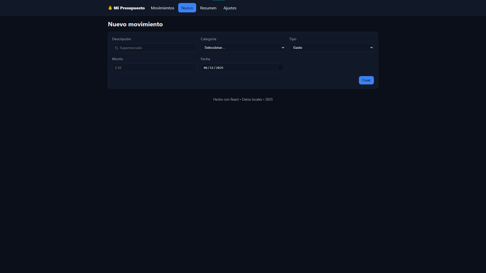
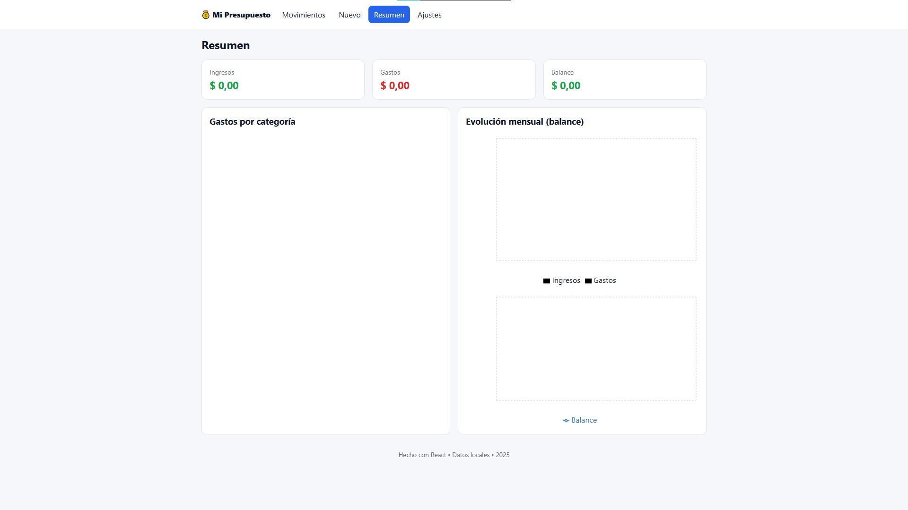

# Mi Presupuesto

App web en React para registrar, visualizar y analizar ingresos y gastos con **persistencia en localStorage**, **filtros/búsquedas/orden**, **CRUD**, **tema oscuro** y **gráficos (Recharts)**.

[](#)
[](#)
[](#)
[](#)
[](#)
[](#)

---

## Características

- **CRUD completo** de movimientos (ingreso/gasto).
- **Filtros, búsqueda y ordenamiento** por texto, tipo, categoría, fecha y monto.
- **Validaciones** con Formik + Yup: descripción, categoría, tipo, monto positivo, fecha válida (no futura).
- **Resumen** con KPIs e **informes gráficos**:
  - Distribución de **gastos por categoría**.
  - **Evolución mensual** (ingresos, gastos y balance).
- **Persistencia** en `localStorage`.
- **Tema oscuro/claro** con toggle global.
- **Ajustes**: limpieza de datos y tema.
- **Buenas prácticas**: componentización, hooks, Context, accesibilidad básica, estilos consistentes.

---

## Pila tecnológica

- **React + Vite**
- **React Router DOM (v6)**
- **Formik + Yup**
- **Recharts**
- **localStorage**
- **CSS**

---

## Instalación

### Prerrequisitos
- **Node.js ≥ 18** y **npm**.

### Pasos
```bash
# 1) Clonar el proyecto
git clone
cd mi-presupuesto

# 2) Instalar dependencias
npm i

# 3) Entorno de desarrollo
npm run dev
# Abre http://localhost:5173/

---

## Capturas de pantalla

### Ajustes



### Movimientos



### Nuevo movimiento



### Resumen


